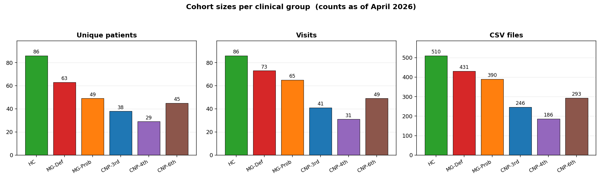
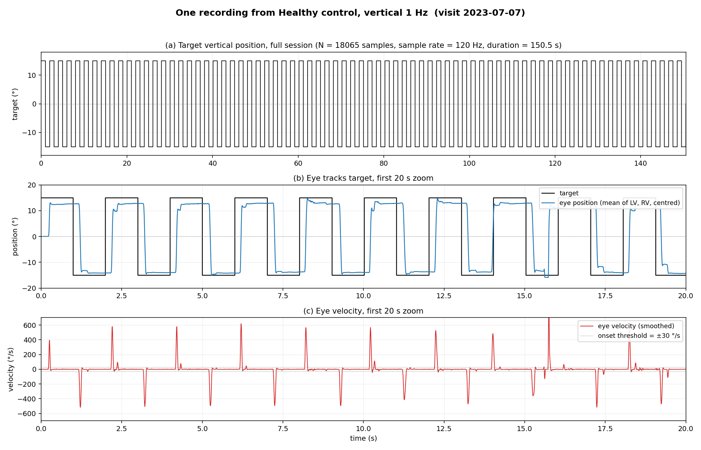
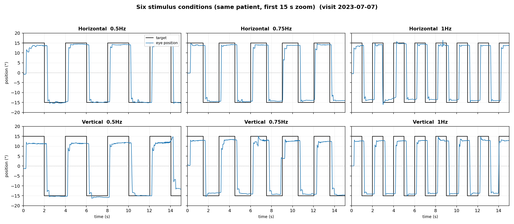
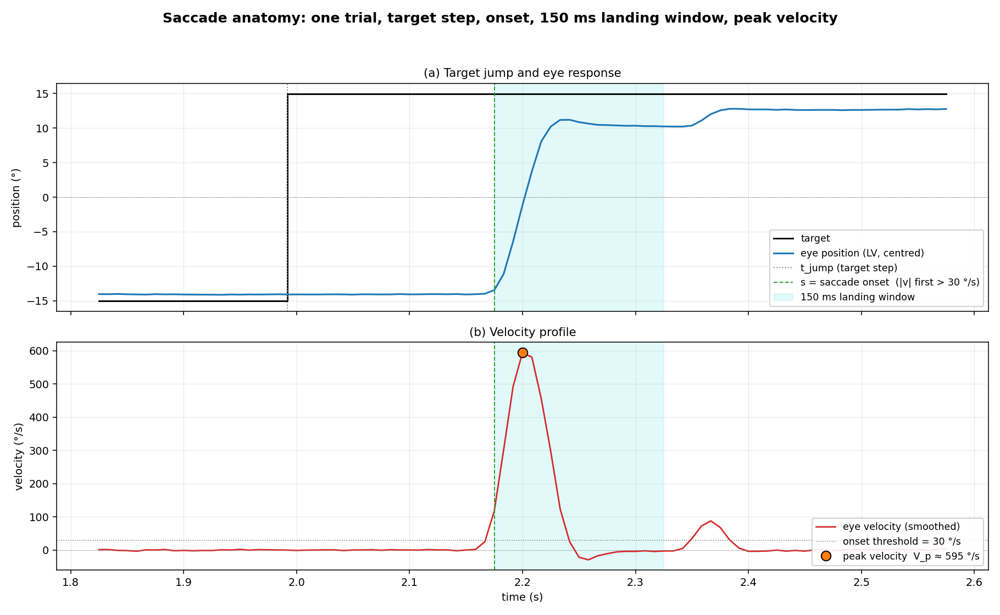
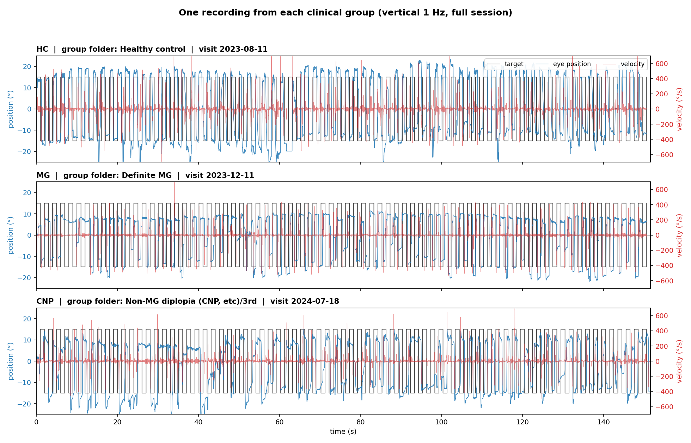
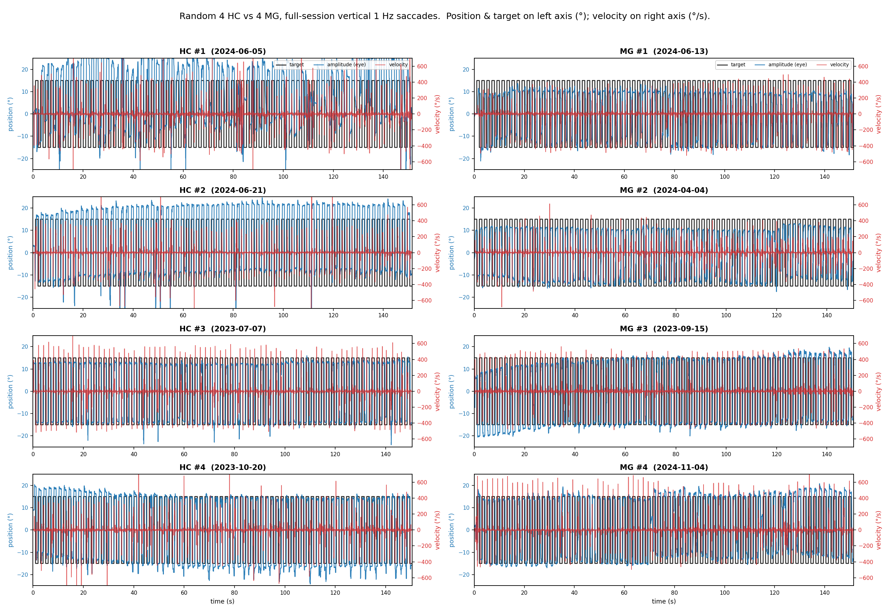
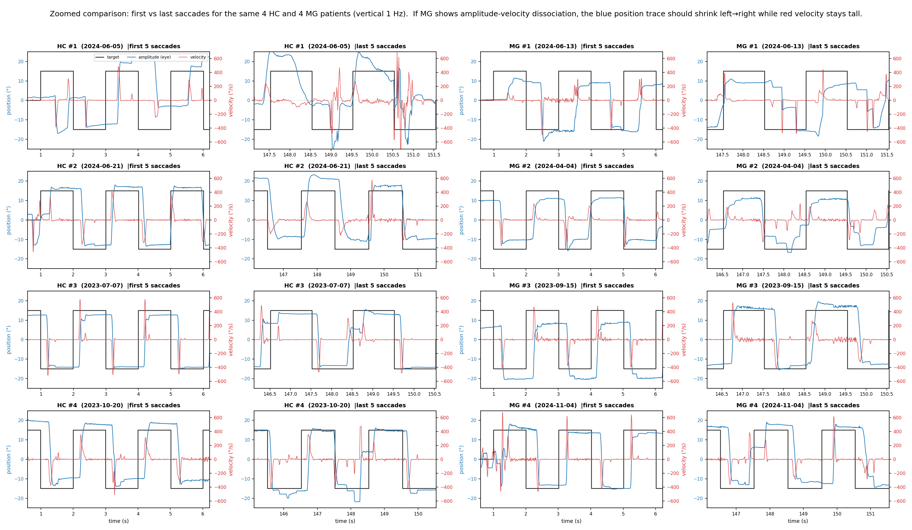
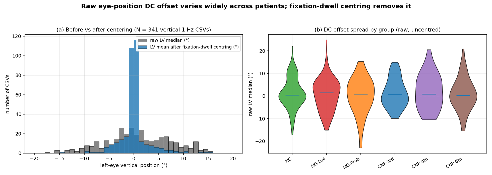
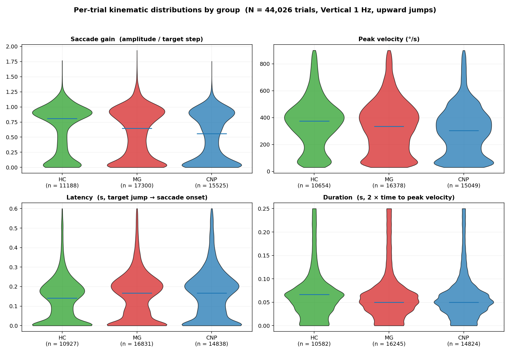

# Myasthenia Gravis Detection from Eye Tracking

Analysis code for detecting Myasthenia Gravis (MG) from 120 Hz video oculography saccade recordings. Data was collected by Dr. Oh's clinical team in Korea. Labels cover Healthy Control (HC), Definite MG, Probable MG, and Non-MG diplopia from 3rd, 4th, and 6th cranial nerve palsy (CNP).

## Repository layout

```
.
├── data/            # raw CSVs (read-only, gitignored)
├── src/
│   ├── utils/       # reusable library code
│   ├── tools/       # one-shot scripts and figure generators
│   └── exp_*.py     # numbered experiments
├── results/         # experiment outputs (gitignored)
├── docs/figures/    # onboarding figures (tracked in git)
├── env/             # Python 3.10 virtualenv (not checked in)
├── requirements.txt
└── scripts/         # auxiliary scripts
```

Everything under `results/` is scratch output from experiments and is not tracked. Everything under `docs/figures/` is tracked and meant to give a new developer a picture of the data without running any code.

## Environment

All code runs in `./env` with Python 3.10. Activate before running anything:

```bash
source env/bin/activate
```

Dependencies are in `requirements.txt`. Add new packages there if you install them.

Run every script from the repo root. Relative paths in scripts assume that.

## The raw data

### Folder layout

```
data/
├── Healthy control/
│   └── 2024-06-05 이동현/
│       ├── 이동현 MG_Horizontal Saccade  B (0.5Hz).csv
│       ├── 이동현 MG_Horizontal Saccade  B (0.75Hz).csv
│       ├── 이동현 MG_Horizontal Saccade  B (1Hz).csv
│       ├── 이동현 MG_Vertical Saccade  B (0.5Hz)_000.csv
│       ├── 이동현 MG_Vertical Saccade  B (0.75Hz)_000.csv
│       └── 이동현 MG_Vertical Saccade  B (1Hz)_000.csv
├── Definite MG/
├── Probable MG/
└── Non-MG diplopia (CNP, etc)/
    ├── 3rd/
    ├── 4th/
    └── 6th/
```

Three levels:

1. Clinical group.
2. One patient visit. Folder name is `YYYY-MM-DD <patient_name>`.
3. One CSV per (axis, frequency) stimulus. Each patient visit produces six CSVs: two axes (Horizontal, Vertical) by three frequencies (0.5 Hz, 0.75 Hz, 1 Hz).

Some patients appear in more than one visit folder. For aggregation, use `(group, stripped_name)` as the patient identifier so that cross-group name collisions stay separate.

### Cohort sizes



| Group               | Unique patients | Visits | CSVs  |
|---------------------|----------------:|-------:|------:|
| Healthy control     | 86              | 86     | 510   |
| Definite MG         | 63              | 73     | 431   |
| Probable MG         | 49              | 65     | 390   |
| CNP 3rd nerve       | 38              | 41     | 246   |
| CNP 4th nerve       | 29              | 31     | 186   |
| CNP 6th nerve       | 45              | 49     | 293   |
| **Total**           | **310**         | **345** | **2056** |

### CSV format

Each CSV holds one stimulus recording sampled at 120 Hz for roughly 150 seconds (about 18,000 rows).

- Encoding: `utf-16-le`
- Separator: `,`
- Header row present, with leading spaces that need stripping

Columns:

| Column      | Meaning                           | Units     |
|-------------|-----------------------------------|-----------|
| `Time(sec)` | sample timestamp                  | seconds   |
| `LH`        | left eye horizontal position      | degrees   |
| `RH`        | right eye horizontal position     | degrees   |
| `LV`        | left eye vertical position        | degrees   |
| `RV`        | right eye vertical position       | degrees   |
| `TargetH`   | target dot horizontal position    | degrees   |
| `TargetV`   | target dot vertical position      | degrees   |

The target dot steps between three positions (roughly -15°, 0°, +15°) and the subject is asked to follow it with their eyes. Each session contains about 75 target jumps.

Minimal load pattern:

```python
import pandas as pd

df = pd.read_csv(csv_path, encoding="utf-16-le", sep=",")
df.columns = [c.strip() for c in df.columns]
```

### What one recording looks like

One HC patient, vertical 1 Hz stimulus, full 150 s session. The top panel shows the target step function across the whole session. The middle panel zooms to the first 20 s with the eye (blue) tracking the target (black). The bottom panel is the velocity trace, one upward and one downward spike per saccade.



### Six stimulus conditions

Same patient across all six conditions (two axes by three frequencies). The first 15 s of each recording. Higher-frequency stimuli step more often in the same window.



### Anatomy of one saccade

This is what one trial looks like. The target steps at `t_jump`. The eye begins a saccade at `s`, defined as the first sample where velocity crosses 30 °/s. The 150 ms after `s` is the landing window, from which the extractor reads amplitude, gain, and peak velocity. The orange dot marks the peak velocity `V_p`.



### Cross-group examples

One random recording from each clinical group. Same 1 Hz vertical stimulus, same ~150 s session length. Target is black, eye position is blue (left axis, degrees), velocity is red (right axis, deg/s).



### HC vs MG at scale

Four random HC patients on the left, four random MG patients on the right.



The same eight patients zoomed to their first five and last five saccades. If a patient is showing fatigability (the clinical MG signature), their position amplitude should shrink from the left-hand zoom to the right-hand zoom while velocity stays tall.



### DC offset and centering

Raw eye-position signals have a patient-specific DC offset. A patient's `LV` median can sit anywhere between roughly -15° and +15° depending on calibration.



The fix, in three steps:

1. Find samples where `|TargetV| < 0.5` (target at the centre-fixation dwell).
2. Compute the mean eye position over those samples.
3. Subtract that mean from the eye signal.

Across all patients sampled, this leaves the eye within about ±2° of zero at centre fixation.

For older files where the target never stops at 0, fall back to the signal's own mean after outlier clipping.

Reference implementation: `fixation_offset` in `src/tools/mg_vs_hc_raw_signal_grid.py`. The target itself is close to zero-centred already, so subtracting its own mean is enough for the target trace.

### Velocity

Velocity is forward-difference on eye position, scaled by the sample rate, then 3-sample moving average. Use the helper in `src/utils/saccade_kinematics.py`:

```python
from src.utils.saccade_kinematics import _smoothed_velocity, DEFAULT_SAMPLE_RATE

v = _smoothed_velocity(eye_position, DEFAULT_SAMPLE_RATE)
```

### Per-trial feature distributions

After running the extractor on every Vertical 1 Hz CSV, the per-trial kinematic features distribute like this across the three main groups:



HC tends to have tighter, higher-gain distributions. MG and CNP both show more spread but differ in ways that are hard to see on a single-feature view. Group separation comes from trial-indexed fatigue dynamics, not from static summary statistics.

## Library code (`src/utils/`)

### `file_metadata.py`

Parses filenames and folder names. Single source of truth for where each group lives on disk.

- `GROUP_PATHS`: dict mapping short keys (`HC`, `MG_Def`, `MG_Prob`, `CNP_3rd`, `CNP_4th`, `CNP_6th`) to their subfolder names under `data/`. Use these keys in code.
- `parse_filename(fname) -> ParsedFilename | None`: returns `(name, axis, frequency)` where `axis` is `"Horizontal"`, `"Vertical"`, or `None`, and `frequency` is `0.5`, `0.75`, or `1.0`.
- `strip_folder_date(folder_name) -> str`: strips the `YYYY-MM-DD ` prefix from a visit folder.
- `patient_id(group, folder_name) -> (group, name)`: the canonical patient identifier.

Run `python src/utils/file_metadata.py` for a self-test that walks the data tree and reports parse stats by group.

### `saccade_kinematics.py`

Pure-function extractor that turns raw samples into per-trial kinematics. Numpy-only.

Constants:

- `DEFAULT_SAMPLE_RATE = 120.0` Hz
- `DEFAULT_TARGET_JUMP_THR = 5.0` degrees
- `DEFAULT_V_ONSET = 30.0` deg/s, `DEFAULT_V_OFFSET = 20.0` deg/s
- `DEFAULT_W_LAND_SAMPLES = 18` samples (150 ms landing window)
- `DEFAULT_MIN_DUR_SAMPLES = 3`, `DEFAULT_MAX_DUR_SAMPLES = 24` samples

Public functions:

- `detect_target_jumps(target, direction="positive", threshold=5.0) -> list[int]`: sample indices where the target stepped. `direction` takes `"positive"`, `"negative"`, or `"both"`.
- `detect_eye_saccade(pos, v_abs, t_jump, ...) -> (onset, offset) | None`: locate one eye-saccade response. Returns `None` if no qualifying saccade exists or its duration is out of bounds.
- `extract_trial_kinematics(pos, target, t_jump, trial_idx) -> TrialKinematics`: one trial's kinematics. Fields:
  - `trial_idx`, `t_jump`, `A_target` (target step, signed)
  - `amplitude` (eye landing peak displacement, signed)
  - `gain = amplitude / A_target`
  - `peak_velocity`, `latency`, `duration`
  - All fields are `NaN` for rejected trials. NaN is not zero.
- `extract_kinematics_for_sequence(eye_pos, target_pos, direction="positive") -> pd.DataFrame`: run the extractor over a whole sequence at once. Usual entry point.

### `fatigue_models.py`

Within-subject normalization and curve fits on trial-indexed kinematic series.

- `normalize_series(y, k_baseline=5, kind="ratio" | "additive")`: divides or subtracts the first-k-trial baseline so the first k samples average to 1 (ratio) or 0 (additive).
- `fit_linear(y_tilde)`, `fit_exponential(y_tilde)`, `fit_changepoint(y_tilde)`: three curve families over the normalised series.
- `compute_fatigue_indices(y_tilde) -> FatigueIndices`: returns the six derived indices `(PD, AUC_def, beta1, a, inv_tau, cp_delta)`.

Sign convention throughout the module: positive means worsening.

### `data_loading.py` (legacy)

Older, more permissive loader used by `exp_01` through `exp_21`. Walks `data/` using a `class_definitions_dict`, then aggregates per-file summary statistics (mean, std, median, IQR) for position, velocity, and eye-target error. Returns one row per CSV.

Use this when you want quick whole-file aggregated features. Use `saccade_kinematics.py` when you want per-trial features.

### `test_partner_formulas.py`

Four pytest tests that pin the fatigue-index formulas. Run them before editing `fatigue_models.py`:

```bash
./env/bin/python -m pytest src/utils/test_partner_formulas.py -q
```

## Pre-extracted per-trial features

Running the full extractor across all CSVs takes a few minutes. The output is cached at:

```
results/exp_22_dynamic_fatigability/kinematic_features_per_trial.parquet
```

One row per `(patient, visit, eye, target-jump)`. 44,026 rows total. Scope: Vertical 1 Hz only, upward jumps only.

| Column            | Meaning                                                     |
|-------------------|-------------------------------------------------------------|
| `group`           | short key: `HC`, `MG_Def`, `MG_Prob`, `CNP_3rd`, `CNP_4th`, `CNP_6th` |
| `group_label`     | collapsed label: `HC`, `MG`, `CNP`                          |
| `subtype`         | human-readable subtype, e.g. `Definite MG`, `3rd`           |
| `patient_name`    | name as it appears in the folder                            |
| `patient_key`     | `(group, name)` serialised                                  |
| `visit_folder`    | `YYYY-MM-DD <name>`                                         |
| `axis`            | always `Vertical` in this parquet                           |
| `frequency`       | always `1.0` in this parquet                                |
| `eye`             | `LV` or `RV`                                                |
| `trial_idx`       | 0-indexed trial within the sequence (before rejection)      |
| `sequential_idx`  | 0-indexed position within kept trials                       |
| `t_jump`          | sample index of the target jump                             |
| `A_target`        | target step amplitude, signed (degrees)                     |
| `amplitude`       | eye landing-window peak displacement, signed                |
| `gain`            | `amplitude / A_target`                                      |
| `peak_velocity`   | max absolute velocity in the 150 ms landing window (deg/s)  |
| `latency`         | seconds from target jump to saccade onset                   |
| `duration`        | `2 * (t_peak_vel - onset) / sample_rate` in seconds         |

Load it like any parquet:

```python
import pandas as pd

df = pd.read_parquet(
    "results/exp_22_dynamic_fatigability/"
    "kinematic_features_per_trial.parquet"
)
```

## Tools (`src/tools/`)

- `make_docs_figures.py`: generates every figure under `docs/figures/` from scratch (figures 01 through 07 above). Run this after any data refresh so onboarding images stay current.
- `mg_vs_hc_raw_signal_grid.py`: produces figures 08 and 09 (random HC vs MG overview and zoom) under `docs/figures/`. Uses the `|TargetV| < 0.5` centering strategy.
- `mg_vs_hc_sanity_check.py`: builds per-patient summary features from the per-trial parquet, runs 5-fold stratified Random Forest cross-validation, writes `predictions.csv` and a confusion matrix to `results/sanity_check_mg_vs_hc/`.
- `make_walkthrough_figures.py`: generates a five-step pipeline figure set under `results/exp_22_dynamic_fatigability/figures/walkthrough/`. Each figure shows one stage of the CSV-to-index pipeline on a single real HC sequence.

To rebuild every `docs/figures/` image in one go:

```bash
./env/bin/python src/tools/make_docs_figures.py
./env/bin/python src/tools/mg_vs_hc_raw_signal_grid.py
```

## Experiments (`src/`)

Numbered scripts from `exp_01_*` through `exp_22_*`. Each writes to its own subdirectory under `results/`.

- `exp_01` through `exp_21` use `data_loading.py` and explore aggregated whole-file features, classical ML, and sequence models.
- `exp_22_dynamic_fatigability.py` uses the per-trial kinematic pipeline. It runs the contract tests in `test_partner_formulas.py`, extracts trials, fits fatigue indices, aggregates to patient level, runs primary endpoints and sensitivity checks, and writes `REPORT.md` to `results/exp_22_dynamic_fatigability/`. A full run takes about ten minutes.

## Results directory

```
results/
├── exp_22_dynamic_fatigability/
│   ├── REPORT.md                              # primary written output
│   ├── kinematic_features_per_trial.parquet   # cached per-trial features
│   ├── fatigue_indices_per_patient.csv        # patient-level fatigue indices
│   ├── primary_endpoint.csv                   # headline effect sizes
│   ├── sensitivity_*.csv                      # robustness checks
│   └── figures/
│       ├── auroc_mg_vs_cnp.png
│       ├── auroc_mg_vs_hc.png
│       ├── di_distribution_mg_vs_cnp.png
│       ├── di_distribution_mg_vs_hc.png
│       └── walkthrough/                       # 5-step pipeline figures
└── sanity_check_mg_vs_hc/
    ├── predictions.csv                        # per-patient OOF predictions
    └── confusion_matrix.txt
```

## Minimal worked example

Load one Vertical 1 Hz CSV, extract per-trial kinematics from the left eye, and print a summary.

```python
import pandas as pd
from src.utils.saccade_kinematics import extract_kinematics_for_sequence

csv = ("data/Healthy control/2024-06-05 이동현/"
       "이동현 MG_Vertical Saccade  B (1Hz)_000.csv")

df = pd.read_csv(csv, encoding="utf-16-le", sep=",")
df.columns = [c.strip() for c in df.columns]

trials = extract_kinematics_for_sequence(
    eye_pos=df["LV"].values,
    target_pos=df["TargetV"].values,
    direction="positive",
)
print(trials[["gain", "peak_velocity", "latency", "duration"]].describe())
```

On a typical HC recording you should see roughly 30 to 40 kept trials, median gain near 1.0, peak velocity around 400 deg/s, latency around 180 ms, and duration around 50 ms.

## Conventions

- Keep the repo root clean. Code in `src/`, data in `data/`, experiment output in `results/`, onboarding figures in `docs/figures/`.
- Set `HF_HOME`, `TORCH_HOME` and similar caches to subfolders under `data/` if you add model caching.
- Edit files in place. Do not create `saccade_kinematics_v2.py` or similar.
- Add new dependencies to `requirements.txt`.
- The `data/` tree is read-only. Do not modify CSVs.
